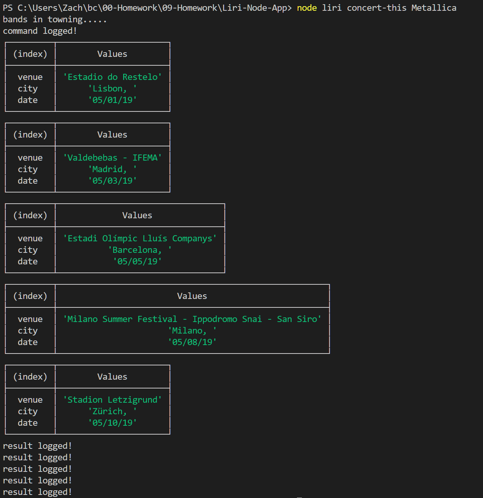
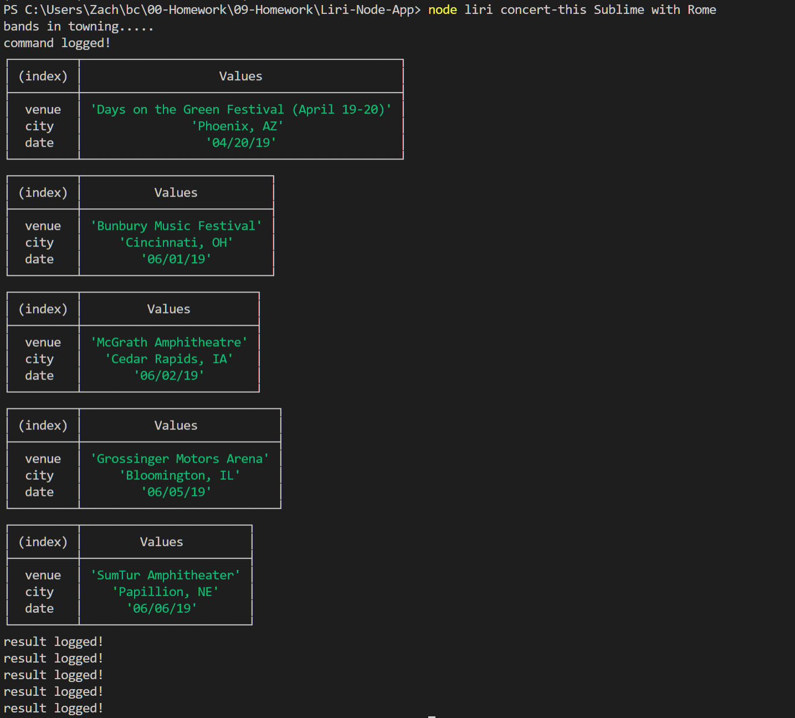
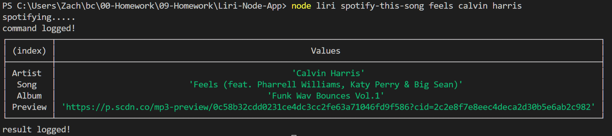
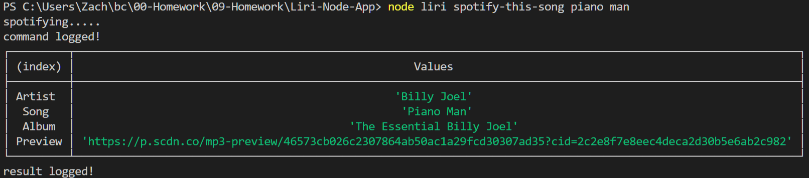
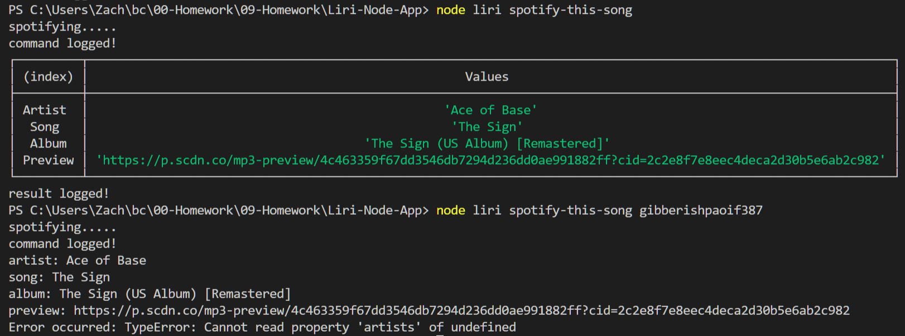
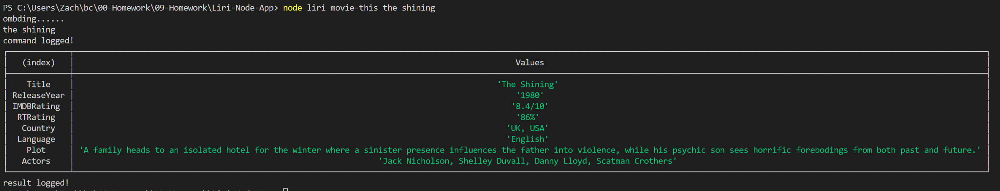
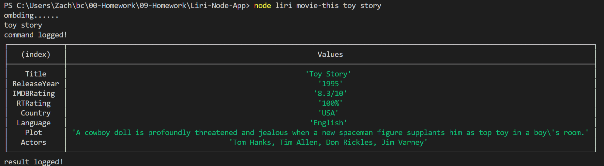
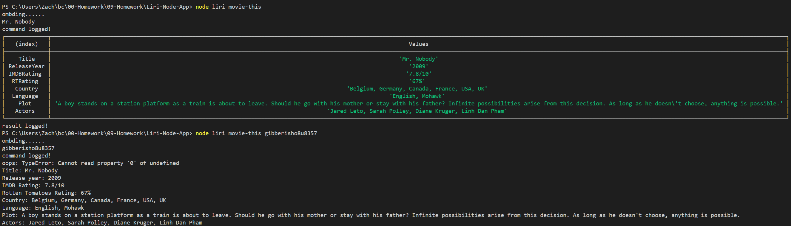
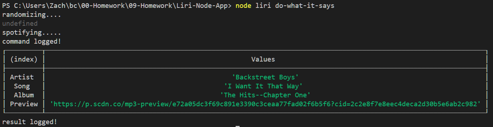
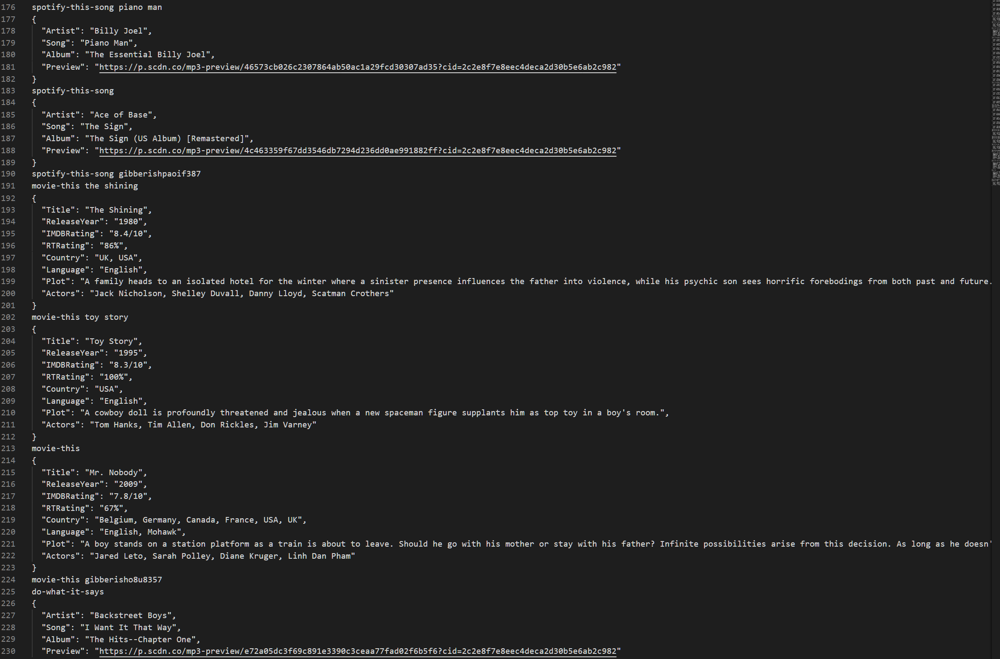

# Liri-Node-App
Like siri, but for node. Pass it the following commands:
 - "concert-this + artist" to get some details on that artist's next 5 concerts:

 - "spotify-this-song" + song to recieve some information on the input song. If it cannot find the song or no song is entered, then details on The Sign by Ace of Base are returned:
 
 
  

 - "movie-this + movie" to get some details on the chosen movie. If it cannot find the movie or no movie is entered, then details on Mr. Nobody are returned:
  
  
  

  

 - "do-what-it-says" to be surprised! This reads a command from random.txt. Currently, it displays information for I want it That Way by the Backstreet Boys:
   

A log of all commands and their results are stored in log.txt:
   

